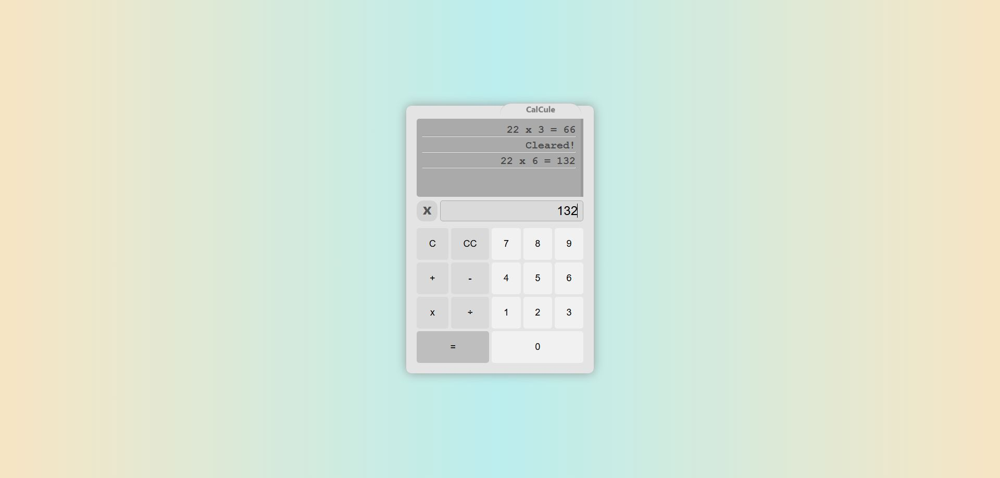

<h1 align="center">----|| CalCule ||----</h1>

A 4-Function Calculator With a Minimal UI and Written by Vanilla-JS that I Call it <strong>CalCule </strong>!

**
 My First Mini Project For {[CodeBox](https://codebox.ir/)} 
**

**
If U liked it, So Star it ⭐ Then Visit My Other [Repos](https://github.com/MohamadeRahbar?tab=repositories) :) 
**

